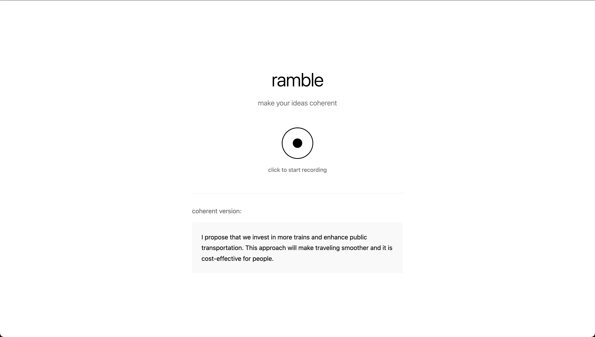

# ramble



convert rambling speech to coherent text using ai

## setup

1. **get api keys**
   - openai: https://platform.openai.com/api-keys

2. **install dependencies**
   ```bash
   cd backend
   npm install
   ```

3. **configure environment**
   - copy `.env` file and add your api keys
   - replace `your_openai_api_key_here` with your actual openai key

4. **run the app**
   ```bash
   npm start
   ```

5. **open browser**
   - go to http://localhost:3000
   - click the circle to record
   - speak your rambling thoughts
   - click again to stop and process